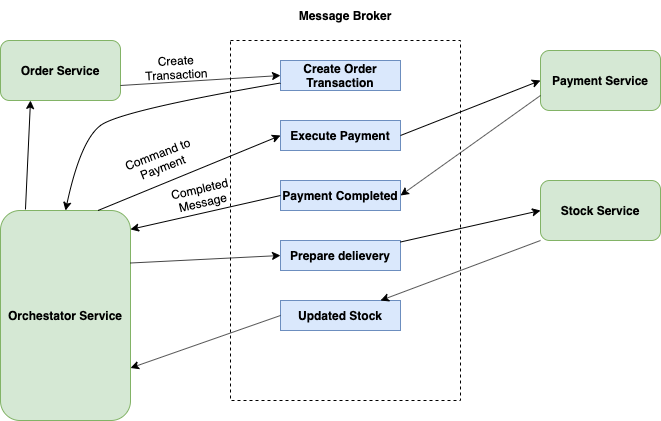

# Saga Pattern Implementation - Nodejs Microservices



## Prerequisites

 - [Kafka](https://kafka.apache.org/downloads)
 - [Nodejs](https://nodejs.org/en/download/)


## Setup

### Kafka Setup

``` 
<Path to kafka>/bin/zookeeper-server-start.sh <Path to Kafka>/config/zookeeper.properties & 
```

```
<Path to kafka>/bin/kafka-server-start/sh <Path to Kafka>/config/server.properties 
```

```
cd kafkaBroker
```

```
 node kafkaBootstrap.js 
```

### Service Setup

### Orchestator Service

```
cd orchestatorService && npm install
```

```
cd orderService && npm install
```

```
cd paymentService && npm install
```


## To Run the Server

```
cd orchestatorService && npm run dev
```

```
cd orderService && npm run dev
```

```
cd paymentService && npm run dev
```